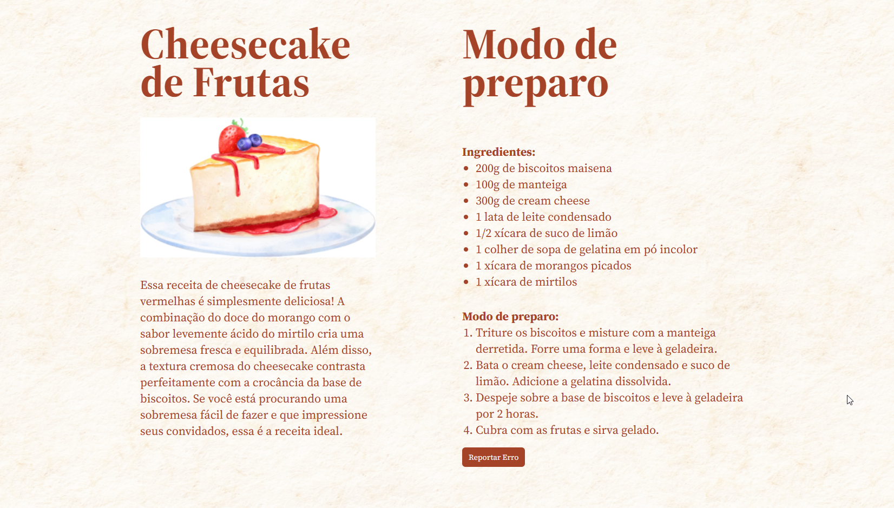

<h1 align="center"> Cheesecake </h1>

Cheesecake de Frutas

Essa receita de cheesecake de frutas vermelhas é simplesmente deliciosa! A combinação do doce do morango com o sabor levemente ácido do mirtilo cria uma sobremesa fresca e equilibrada. Além disso, a textura cremosa do cheesecake contrasta perfeitamente com a crocância da base de biscoitos. Se você está procurando uma sobremesa fácil de fazer e que impressione seus convidados, essa é a receita ideal.

 

  

